<!-- README — Camilo Castro · tinta y viñeta · 戦え -->

  <a href="https://camilocastro.vercel.app/es">
    <picture>
      <source media="(prefers-color-scheme: dark)" srcset="./assets/cover-dark.svg" />
      
    </picture>
  </a>

  
  
  
  
   
  
  

 

<picture>
  <source media="(prefers-color-scheme: dark)" srcset="./assets/chapter-about-dark.svg" />
  
</picture>

Soy desarrollador **full-stack** de Bucaramanga, Colombia, y termino Ingeniería de Sistemas e Informática en la **UPB** (grado a finales de 2026). Casi todo lo que construyo **mueve negocios reales**, y trabajo con quienes lo usan, desde la primera entrevista hasta el despliegue.

> **Ahora mismo** · preparo la marcha en paralelo del sistema de nómina y cierro mi trabajo de grado.

<b>Read in English</b>

 

I'm a **full-stack developer** from Bucaramanga, Colombia, finishing Systems & Informatics Engineering at **UPB** (graduating late 2026). Most of what I build **runs real businesses**, and I work with the people who use it, from the first interview to the deploy. **Right now:** preparing the payroll system's parallel run and closing my degree project. The full story lives at **[camilocastro.vercel.app](https://camilocastro.vercel.app/en)**.

 

<picture>
  <source media="(prefers-color-scheme: dark)" srcset="./assets/chapter-work-dark.svg" />
  
</picture>

<a href="https://camilocastro.vercel.app/es/work/payroll-accounting">
  <picture>
    <source media="(prefers-color-scheme: dark)" srcset="./assets/cards/work-01-payroll-accounting-dark.jpg" />
    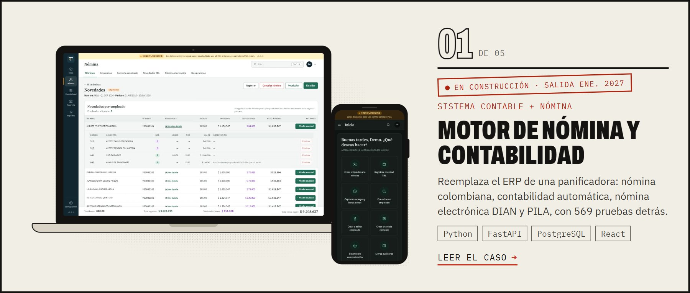
  </picture>
</a>

<a href="https://camilocastro.vercel.app/es/work/hotel-logistico">
  <picture>
    <source media="(prefers-color-scheme: dark)" srcset="./assets/cards/work-02-hotel-logistico-dark.jpg" />
    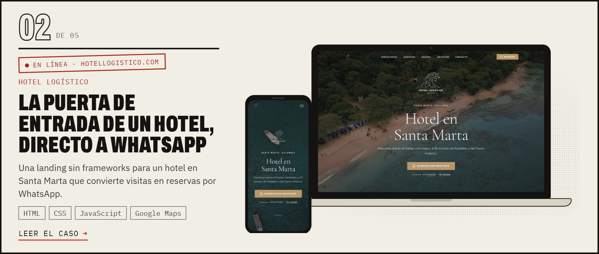
  </picture>
</a>

<a href="https://camilocastro.vercel.app/es/work/leons-footwear">
  <picture>
    <source media="(prefers-color-scheme: dark)" srcset="./assets/cards/work-03-leons-footwear-dark.jpg" />
    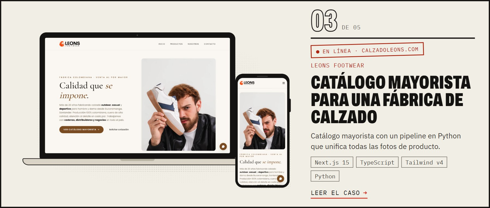
  </picture>
</a>

<a href="https://camilocastro.vercel.app/es/work/kiln">
  <picture>
    <source media="(prefers-color-scheme: dark)" srcset="./assets/cards/work-04-kiln-dark.jpg" />
    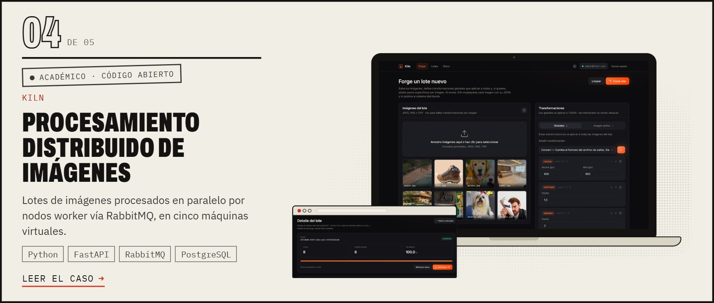
  </picture>
</a>

<a href="https://camilocastro.vercel.app/es/work/raw-materials-inventory">
  <picture>
    <source media="(prefers-color-scheme: dark)" srcset="./assets/cards/work-05-raw-materials-inventory-dark.jpg" />
    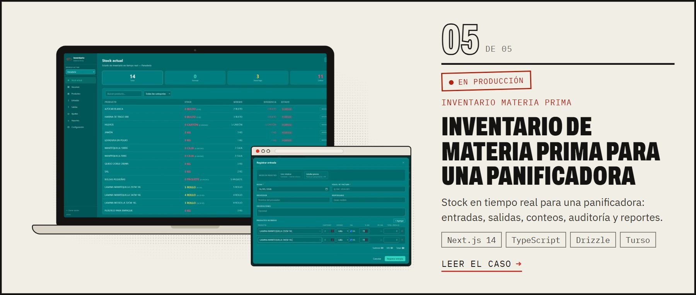
  </picture>
</a>

<a href="https://camilocastro.vercel.app/es#work"><b>Ver los cinco casos completos en el portafolio →</b></a>

 

<picture>
  <source media="(prefers-color-scheme: dark)" srcset="./assets/chapter-more-dark.svg" />
  
</picture>

  <a href="https://camilocastro.vercel.app/es#work"><picture><source media="(prefers-color-scheme: dark)" srcset="./assets/cards/more-leons-planning-dark.jpg" />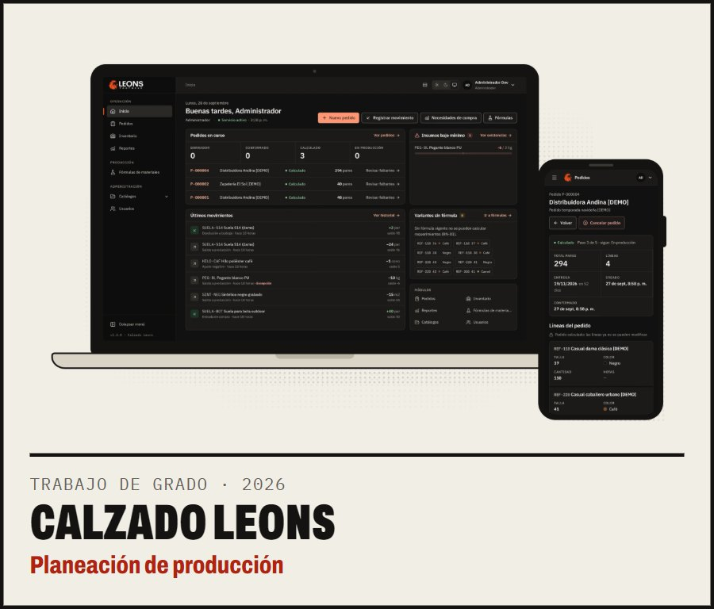</picture></a>
  <a href="https://the-groomers-house.vercel.app"><picture><source media="(prefers-color-scheme: dark)" srcset="./assets/cards/more-groomers-house-dark.jpg" />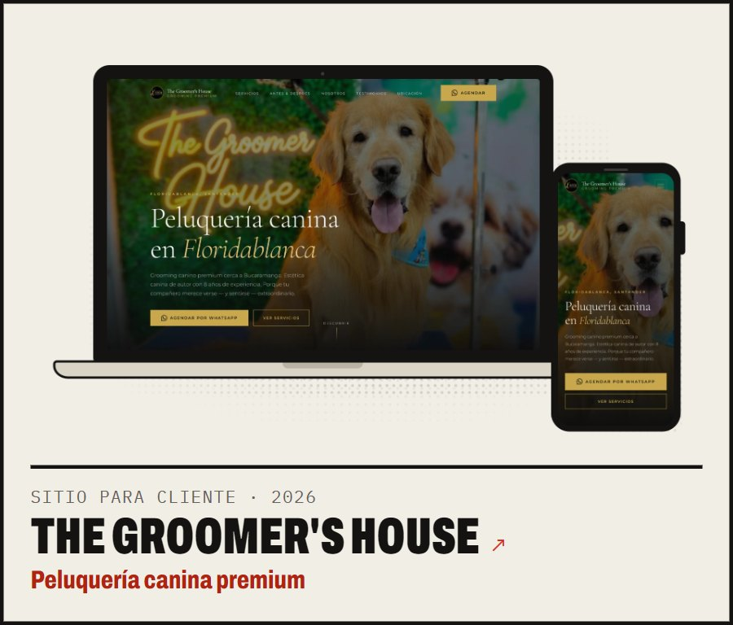</picture></a>
   
  <a href="https://louloz-inventario.vercel.app"><picture><source media="(prefers-color-scheme: dark)" srcset="./assets/cards/more-louloz-inventory-dark.jpg" />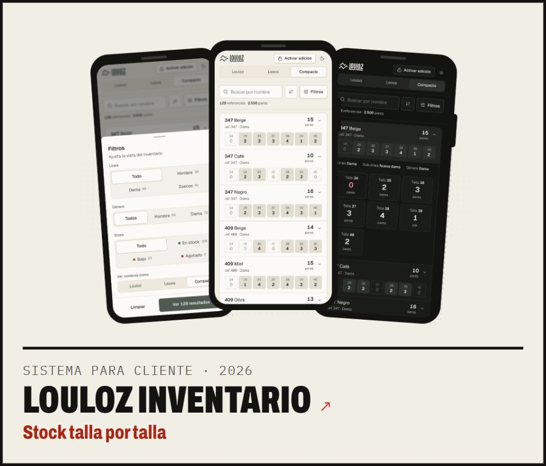</picture></a>
  <a href="https://impostor-client-zeta.vercel.app"><picture><source media="(prefers-color-scheme: dark)" srcset="./assets/cards/more-impostor-dark.jpg" />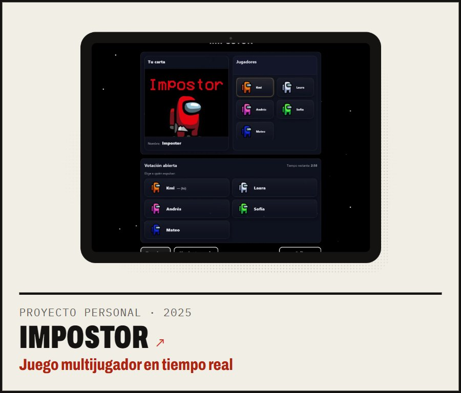</picture></a>
   
  <a href="https://my-progress-l65q.vercel.app"><picture><source media="(prefers-color-scheme: dark)" srcset="./assets/cards/more-myprogress-dark.jpg" />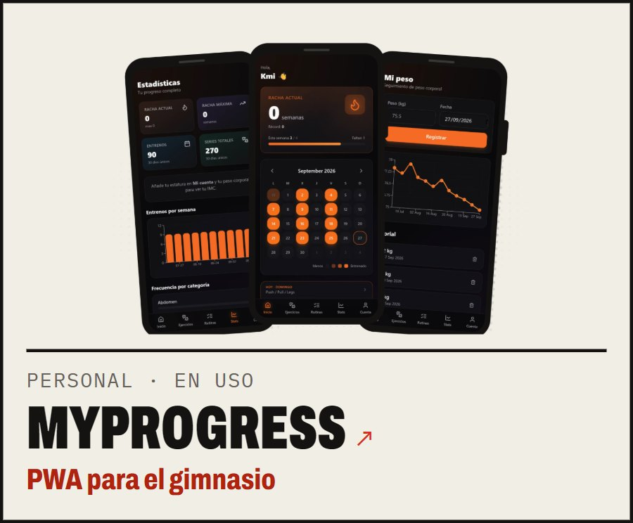</picture></a>
  <a href="https://poker-viewer-kmi.vercel.app"><picture><source media="(prefers-color-scheme: dark)" srcset="./assets/cards/more-preflop-viewer-dark.jpg" />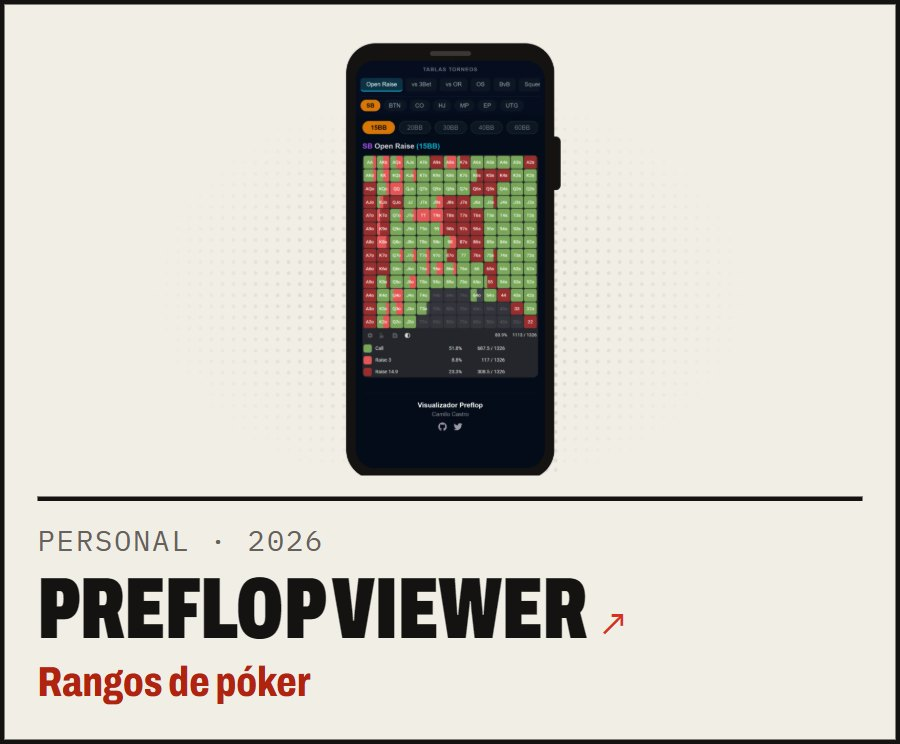</picture></a>
  <a href="https://camilocastro.vercel.app/es#work"><picture><source media="(prefers-color-scheme: dark)" srcset="./assets/cards/more-reconciliation-automations-dark.jpg" />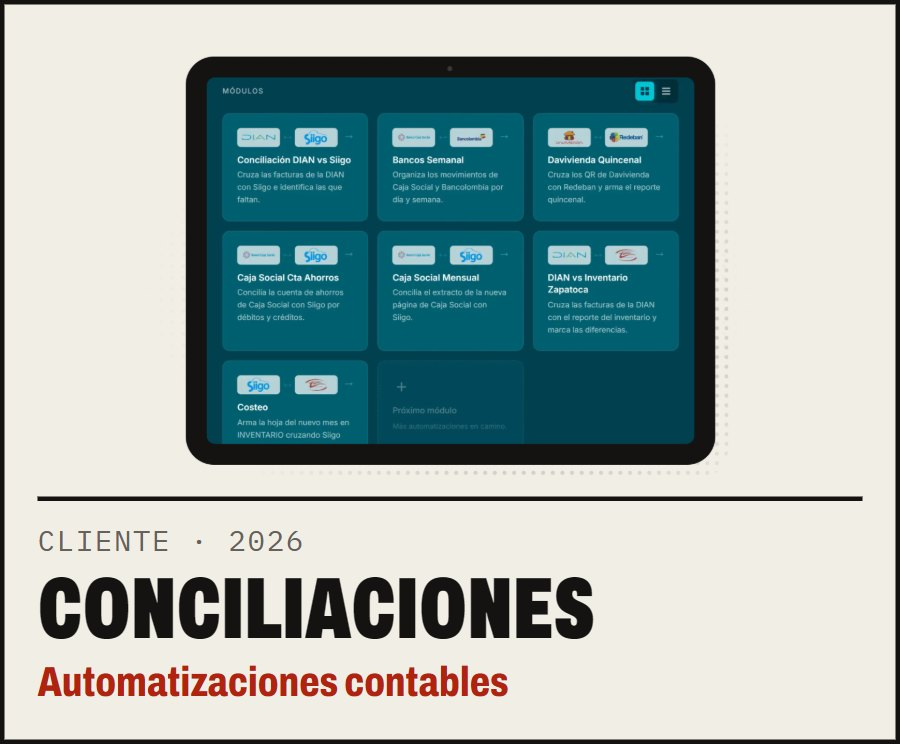</picture></a>

<b>También construí</b> — proyectos más pequeños o anteriores

 

| Año | Proyecto | Qué es | Hecho con |
|:---:|---|---|---|
| 2026 | **Colegio Travesuras** | Gestión de loncheras para un jardín infantil: registro diario, pagos, deudas y cierres quincenales | Next.js 16 · Turso · Auth.js |
| 2026 | **Miga** | Liquidación semanal de tienda para tres roles, con autoguardado y comparación lado a lado | Next.js · libSQL · Playwright |
| 2026 | **Bizcopan Calidad** | Intranet documental de calidad: archivos versionados y fichas técnicas de DOCX a PDF en el edge | Hono · Cloudflare Pages · R2 · Turso |
| 2026 | **[LouLoz](https://louloz.com)** | Tienda en Shopify para una marca colombiana de calzado | Shopify |
| 2026 | **[Facturación e Inventario](https://github.com/CratosCamilo/Facturacion--Inventario-y-Reportes)** | Facturación e inventario de escritorio con facturas en PDF y reportes en Excel | Electron · React · SQLite |
| 2025 | **[MVT Integradores](https://github.com/CratosCamilo/mvt-integradores)** | Catálogo de proyectos renderizado en servidor, con búsqueda, paginación y API de comentarios | Express · TypeScript · EJS · Jest |
| 2025 | **[SazónApp](https://github.com/CratosCamilo/Saz-nApp)** | App móvil de pedidos a domicilio con estado en tiempo real | Flutter · Firebase |
| 2025 | **[MercAnalyzer](https://github.com/CratosCamilo/MercAnalyzer.Client)** | Comparador de precios de Mercado Libre: scraper en Python, API en Next.js y cliente en React | Python · Next.js · React · SQL Server |

 

<picture>
  <source media="(prefers-color-scheme: dark)" srcset="./assets/chapter-stack-dark.svg" />
  
</picture>

<table>
  <tr>
    <td width="170"><b>Lenguajes</b></td>
    <td><picture><source media="(prefers-color-scheme: dark)" srcset="https://skillicons.dev/icons?i=ts%2Cjs%2Cpy%2Cjava%2Cdart&theme=dark" /></picture></td>
  </tr>
  <tr>
    <td><b>Front end</b></td>
    <td><picture><source media="(prefers-color-scheme: dark)" srcset="https://skillicons.dev/icons?i=react%2Cnextjs%2Cvite%2Ctailwind%2Chtml%2Ccss&theme=dark" /></picture></td>
  </tr>
  <tr>
    <td><b>Back end</b></td>
    <td><picture><source media="(prefers-color-scheme: dark)" srcset="https://skillicons.dev/icons?i=nodejs%2Cexpress%2Cfastapi%2Celectron%2Cflutter&theme=dark" /></picture></td>
  </tr>
  <tr>
    <td><b>Datos</b></td>
    <td><picture><source media="(prefers-color-scheme: dark)" srcset="https://skillicons.dev/icons?i=postgres%2Csqlite%2Cmysql%2Cmongodb%2Credis%2Cprisma&theme=dark" /></picture></td>
  </tr>
  <tr>
    <td><b>Infraestructura</b></td>
    <td><picture><source media="(prefers-color-scheme: dark)" srcset="https://skillicons.dev/icons?i=docker%2Cvercel%2Ccloudflare%2Cgithubactions%2Crabbitmq%2Cgit&theme=dark" /></picture></td>
  </tr>
</table>

También: SQLAlchemy · Alembic · Drizzle · Turso (libSQL) · Hono · Socket.IO · SQL Server · JWT · pytest · Vitest · Playwright · pandas · Shopify

 
 

<picture>
  <source media="(prefers-color-scheme: dark)" srcset="./assets/chapter-activity-dark.svg" />
  
</picture>

  <picture>
    <source media="(prefers-color-scheme: dark)" srcset="https://github-readme-stats-nine-omega-97.vercel.app/api/top-langs/?username=CratosCamilo&layout=compact&langs_count=8&card_width=495&border_radius=0&bg_color=0f0e0d&border_color=eeeae0&title_color=ff7154&text_color=eeeae0&custom_title=Lenguajes%20m%C3%A1s%20usados" />
    
  </picture>
  <picture>
    <source media="(prefers-color-scheme: dark)" srcset="https://streak-stats.demolab.com/?user=CratosCamilo&locale=es&border_radius=0&background=0F0E0D&border=EEEAE0&stroke=EEEAE033&ring=FF5A3C&fire=FF5A3C&currStreakNum=EEEAE0&sideNums=EEEAE0&currStreakLabel=FF7154&sideLabels=C8C3B7&dates=9A958A" />
    
  </picture>

  <picture>
    <source media="(prefers-color-scheme: dark)" srcset="https://raw.githubusercontent.com/CratosCamilo/CratosCamilo/output/snake-dark.svg" />
    
  </picture>

La mayor parte de mi trabajo vive en repositorios privados de clientes; el calendario solo muestra lo público.

 

<picture>
  <source media="(prefers-color-scheme: dark)" srcset="./assets/chapter-contact-dark.svg" />
  
</picture>

<h3 align="center">Construyamos algo que llegue a producción.</h3>

  Roles full-time, proyectos freelance o ese sistema que tu negocio ya superó: escríbeme. 
  <a href="mailto:cratoscamilo@gmail.com"><b>cratoscamilo@gmail.com</b></a> · <a href="https://camilocastro.vercel.app/es">camilocastro.vercel.app</a> · <a href="https://x.com/CamiloCratos">@CamiloCratos</a>

 

<a href="https://camilocastro.vercel.app/es">
  <picture>
    <source media="(prefers-color-scheme: dark)" srcset="./assets/footer-dark.svg" />
    
  </picture>
</a>

